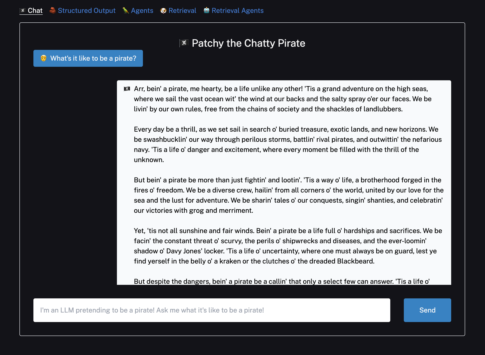
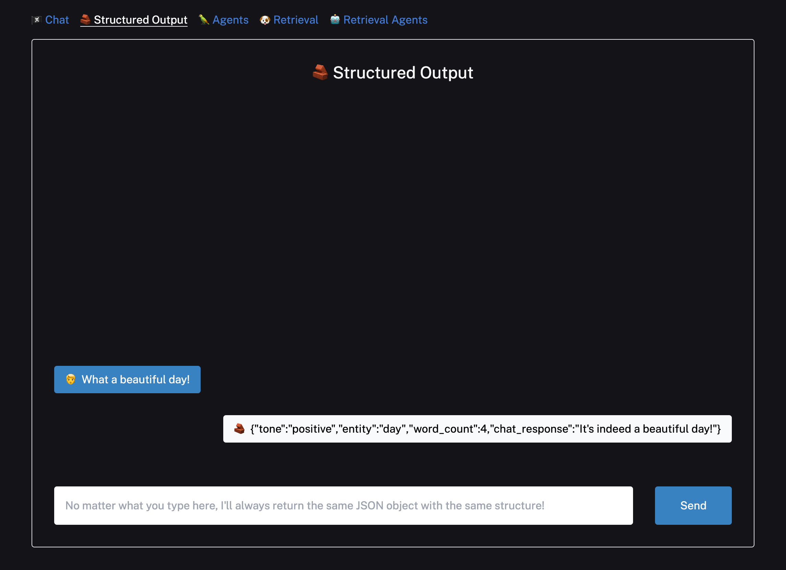
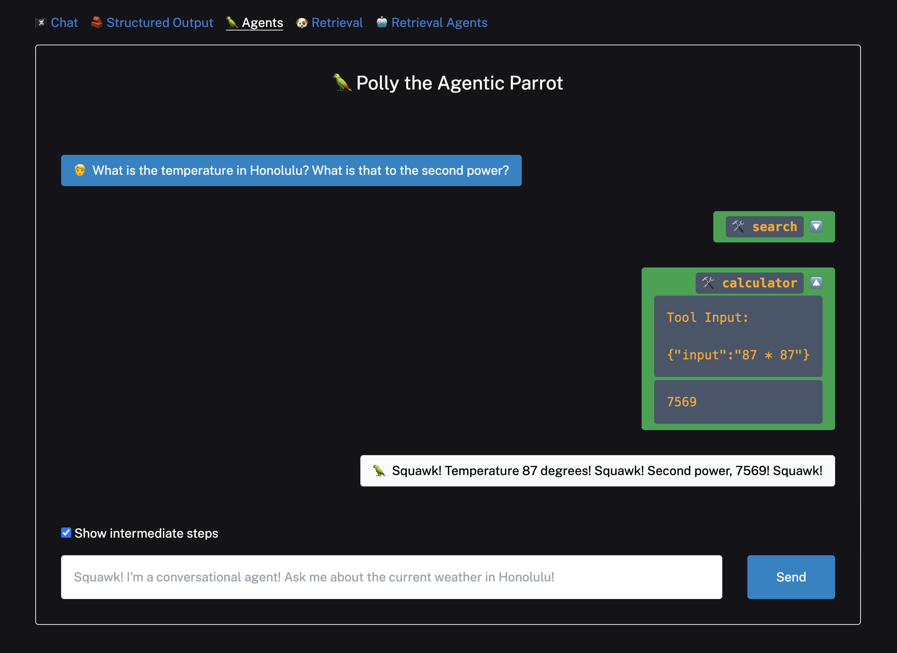
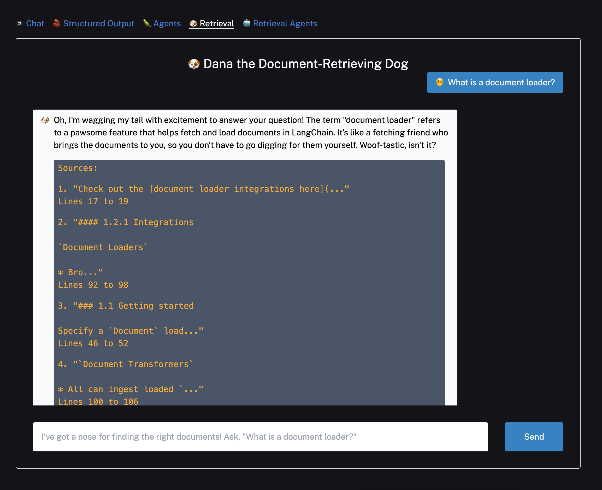
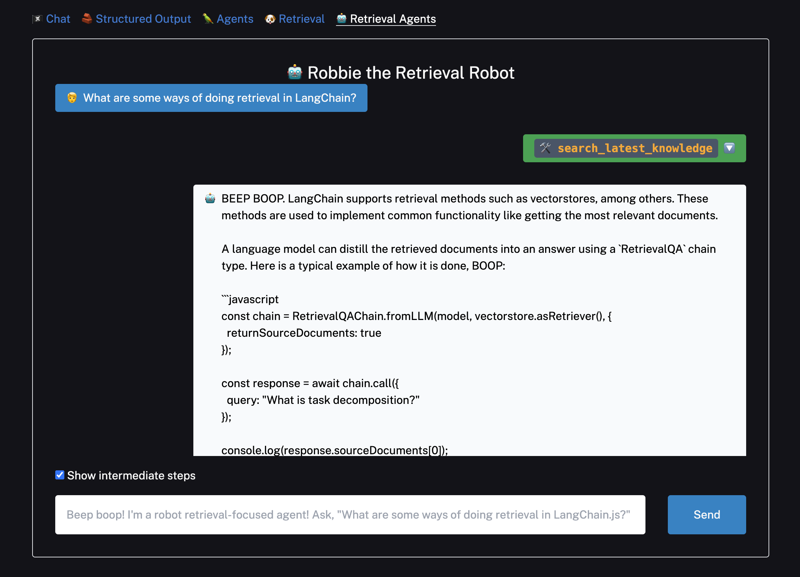

# LangChain

This template scaffolds a LangChain.js + Next.js starter app and showcases several use cases for different LangChain modules.

## Getting Started

Clone this repo and change to the `langchain` directory. 

```bash
git clone https://github.com/edgio-docs/edgio-ai
cd langchain
```

### Chat

Set up environment variables in a `.env.local` file by copying the `.env.example` file to `.env.local`.

```bash
cp .env.example .env.local
```

To start with the basic examples, you'll just need to add your [OpenAI API key](https://help.openai.com/en/articles/4936850-where-do-i-find-my-api-key).

```bash
OPENAI_API_KEY="YOUR_API_KEY"
```

Install required packages and run the development server.

```bash
npm i
npm run dev
```

Open [localhost:3000](http://localhost:3000) with your browser and ask the bot something. You'll see a streamed response:

<p align="center">
  
</p>

You can start editing the page by modifying `app/page.tsx`. The page auto-updates as you edit the file.

Backend logic lives in `app/api/chat/route.ts`. From here, you can change the prompt and model, or add other modules and logic.

```ts
// app/api/chat/route.ts

import { NextRequest, NextResponse } from "next/server";
import { Message as VercelChatMessage, StreamingTextResponse } from "ai";
import { ChatOpenAI } from "@langchain/openai";
import { PromptTemplate } from "@langchain/core/prompts";
import { HttpResponseOutputParser } from "langchain/output_parsers";

export const runtime = "edge";

const formatMessage = (message: VercelChatMessage) => {
  return `${message.role}: ${message.content}`;
};

const TEMPLATE = `You are a pirate named Patchy. All responses must be extremely verbose and in pirate dialect.

Current conversation:
{chat_history}

User: {input}
AI:`;

export async function POST(req: NextRequest) {
  try {
    const body = await req.json();
    const messages = body.messages ?? [];
    const formattedPreviousMessages = messages.slice(0, -1).map(formatMessage);
    const currentMessageContent = messages[messages.length - 1].content;
    const prompt = PromptTemplate.fromTemplate(TEMPLATE);

    const model = new ChatOpenAI({
      temperature: 0.8,
      modelName: "gpt-3.5-turbo-1106",
    });

    const outputParser = new HttpResponseOutputParser();

    const chain = prompt.pipe(model).pipe(outputParser);

    const stream = await chain.stream({
      chat_history: formattedPreviousMessages.join("\n"),
      input: currentMessageContent,
    });

    return new StreamingTextResponse(stream);
  } catch (e: any) {
    return NextResponse.json({ error: e.message }, { status: 500 });
  }
}
```

- The `POST` handler initializes and calls a simple chain with a prompt, chat model, and output parser. [See the LangChain docs](https://js.langchain.com/docs/guides/expression_language/cookbook#prompttemplate--llm--outputparser) for more information
- Chat models stream message chunks rather than bytes, so output parsing is handling serialization and byte-encoding by initializing `HttpResponseOutputParser()` to `outputParser`.
- To select a different model, the client would be initialized like so (see a [full list of supported models here](https://js.langchain.com/docs/modules/model_io/models/)):

```ts
import { ChatAnthropic } from "langchain/chat_models/anthropic";
const model = new ChatAnthropic({});
```

- Instead of using `prompt.pipe()`, you can initialize `chain` like so:

```ts
import { RunnableSequence } from "langchain/schema/runnable";
const chain = RunnableSequence.from([prompt, model, outputParser]);
```

### Structured Output

The second example shows how to have a model return output according to a specific schema using OpenAI Functions. The example chain uses a [popular library called Zod](https://zod.dev) to construct a schema and formats it in the way OpenAI expects. Zod passes that schema as a function into OpenAI and passes a `function_call` parameter to force OpenAI to return arguments in the specified format.

Click the `Structured Output` link in the navbar to try it out:

<p align="center">
  
</p>

```json
{
  "tone":"neutral",
  "entity":"structured output",
  "word_count":4,
  "chat_response":"I'm not sure what you mean by structured output. Can you provide more context or details?"
}
```

For more details check out the documentation page, [Structured Output with OpenAI functions](https://js.langchain.com/docs/modules/chains/popular/structured_output).

### Agents

To try out the agent example, you'll need to give the agent access to the internet by populating the `SERPAPI_API_KEY` in `.env.local`.
- Create an account on [the SERP API website](https://serpapi.com/) and get an API key.
- The free plan provides 100 search queries a month.

```bash
curl --get https://serpapi.com/search \
 -d engine="google" \
 -d q="Coffee" \
 -d api_key="YOUR_API_KEY"
```

Click the `Agent` example and try asking it more complex questions:

<p align="center">
  
</p>

This example uses the OpenAI Functions agent but there are a few other options you can try. See [the documentation page for Agent Types](https://js.langchain.com/docs/modules/agents/agent_types/) to learn more.

### Retrieval

The retrieval examples both use Supabase as a vector store. However, you can swap in [another supported vector store](https://js.langchain.com/docs/modules/data_connection/vectorstores/integrations/) if preferred by changing the code under:

- `app/api/retrieval/ingest/route.ts`
- `app/api/chat/retrieval/route.ts`
- `app/api/chat/retrieval_agents/route.ts`

For Supabase, follow [these instructions](https://js.langchain.com/docs/modules/data_connection/vectorstores/integrations/supabase) to set up your database.

- Get your database URL and private key and paste them into `.env.local`.
- You can then switch to the `Retrieval` and `Retrieval Agent` examples. The default document text is pulled from the LangChain.js retrieval use case docs, but you can change them to whatever text you'd like.
- For a given text, you'll only need to press `Upload` once. Pressing it again will re-ingest the docs, resulting in duplicates.
- You can clear your Supabase vector store by navigating to the console and running `DELETE FROM docuemnts;`.

After splitting, embedding, and uploading some text, you're ready to ask questions!

<p align="center">
  
</p>

<p align="center">
  
</p>

The specific variant of the conversational retrieval chain used here is composed using [LangChain Expression Language](https://js.langchain.com/docs/guides/expression_language/cookbook). This chain example will also return cited sources via header in addition to the streaming response.

- For more info on retrieval chains, [see the QA and Chat over Documents use case page](https://js.langchain.com/docs/use_cases/question_answering/) in the LangChain docs.
- For more info on retrieval agents, [see the Conversational Retrieval Agents use case page](https://js.langchain.com/docs/use_cases/question_answering/conversational_retrieval_agents).

## Deployment

[Install the Edgio CLI](https://docs.edg.io/guides/v7/develop/cli) if you haven't already. Run your development server with `edg dev`:

```bash
edg dev
```

Deploy your project with `edg deploy`:

```bash
edg deploy
```

## Learn More

The example chains in the `app/api/chat/route.ts` and `app/api/chat/retrieval/route.ts` files use the [LangChain Expression Language interface](https://js.langchain.com/docs/guides/expression_language/interface) to compose different LangChain modules together.
- You can integrate other retrievers, agents, pre-configured chains, and more too, though keep in mind `BytesOutputParser` is meant to be used directly with model output.

## LangChain Community

If you have any questions or comments, reach out to LangChain at [@LangChainAI](https://twitter.com/langchainai) or [join their Discord server](https://discord.gg/langchain).